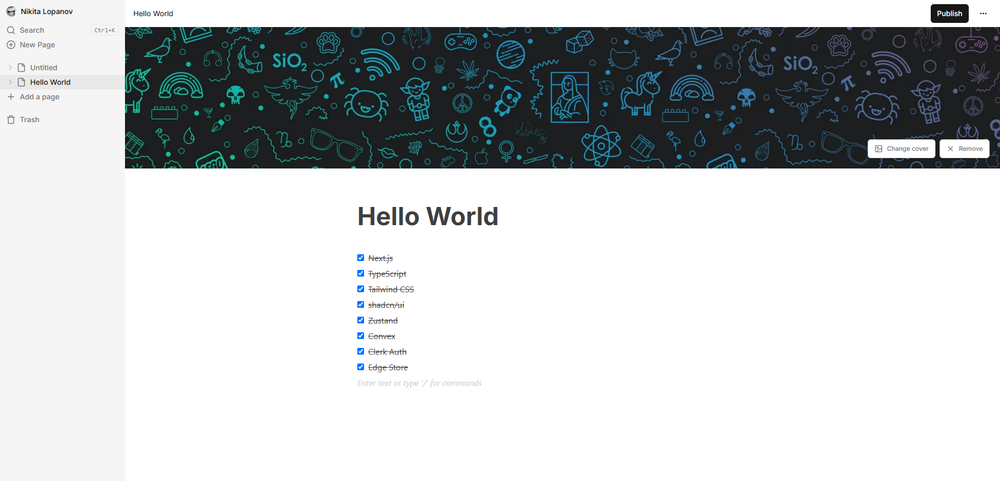

# Next.js Notion Clone

Клон Notion, созданный с использованием Next.js



## Dev стак

Next.js, TypeScript, Tailwind CSS, shadcn/ui, Zustand, Convex, Clerk Auth, Edge Store

## Запуск проекта

Инструкция по настройке и запуску проекта на локальном компьютере.

1. **Клонирование репозитория:**

```bash
git clone https://github.com/Ibarakilol/nextjs-notion-clone.git
cd nextjs-notion-clone
```

2. **Настройка переменных среды:**

Создайте файл .env.local в корневом каталоге проекта и задайте необходимые переменные среды.

```
CONVEX_DEPLOYMENT=
NEXT_PUBLIC_CONVEX_URL=

NEXT_PUBLIC_CLERK_PUBLISHABLE_KEY=
CLERK_SECRET_KEY=

EDGE_STORE_ACCESS_KEY=
EDGE_STORE_SECRET_KEY=
```

На панели управления Convex перейдите на вкладку Settings вашего проекта и добавьте в Environment Variables ключ `CLERK_AUTH_URL` с URL-адресом Clerk auth.

3. **Установка зависимостей и запуск:**

```bash
npm i
```

После этого, в первом терминале запустите сам проект `npm run dev`, а во втором сервер Convex `npx convex dev`
